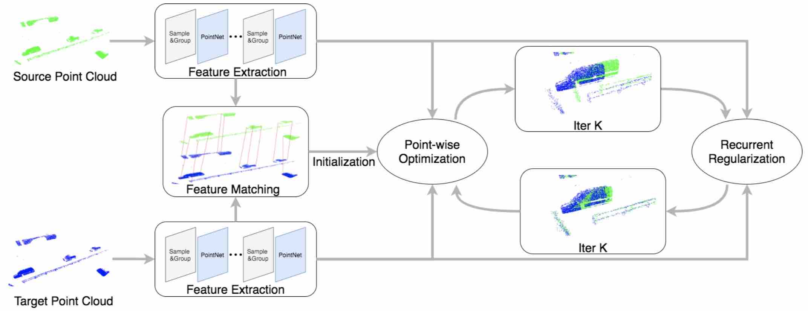

# RCP: Recurrent Closest Point for Scene Flow Estimation on 3D Point Clouds
This is the official PyTorch implementation code for RCP. For technical details, please refer to:

**RCP: Recurrent Closest Point for Scene Flow Estimation on 3D Point Clouds** <br />
Xiaodong Gu, Chengzhou Tang, Weihao Yuan, Zuozhuo Dai, Siyu Zhu, Ping Tan <br />
**[[Paper](https://arxiv.org/abs/2205.11028)]** <br />




## Installation  
+ Install python dependencies lib:
```
pip install -r requirements.txt  
```
+ Install PointNet2 CPP lib:
```
cd lib/pointnet2
python3 setup.py install
```

## Datasets
We follow [HPLFlowNet](https://github.com/laoreja/HPLFlowNet) preprocessing methods:

+ FlyingThings3D: Download and unzip the "Disparity", "Disparity Occlusions", "Disparity change", "Optical flow", "Flow Occlusions" for DispNet/FlowNet2.0 dataset subsets from the [FlyingThings3D website](https://lmb.informatik.uni-freiburg.de/resources/datasets/SceneFlowDatasets.en.html) (we used the paths from [this file](https://lmb.informatik.uni-freiburg.de/data/FlyingThings3D_subset/FlyingThings3D_subset_all_download_paths.txt), now they added torrent downloads) . They will be upzipped into the same directory, RAW_DATA_PATH. Then run the following script for 3D reconstruction:
```
python data/preprocess/process_flyingthings3d_subset.py --raw_data_path ${RAW_DATA_PATH} --save_path ${SAVE_PATH}/FlyingThings3D_subset_processed_35m --only_save_near_pts
```

+ KITTI: Download and unzip [KITTI Scene Flow Evaluation 2015](http://www.cvlibs.net/download.php?file=data_scene_flow.zip) to directory RAW_DATA_PATH. Run the following script for 3D reconstruction:
```
python data/preprocess/process_kitti.py ${RAW_DATA_PATH} ${SAVE_PATH}/KITTI_processed_occ_final
```

## Training

+ Fully-supervised training:
```bash
python run.py -c configs/train/rcp_sup_pre.yaml
python run.py -c configs/train/rcp_sup_ft.yaml --pre_ckpt ${pretrained_ckpt}
```

+ Self-supervised training:
```bash
python run.py -c configs/train/rcp_self_pre.yaml
python run.py -c configs/train/rcp_self_ft.yaml --pre_ckpt ${pretrained_ckpt}
```

## Evaluation

+ Evaluate on FlyingThings3D
```
python run.py -c configs/test/rcp_test.yaml --test_ckpt ${ft_ckpt}
```
+ Evaluate on KITTI
```
python run.py -c configs/test/rcp_test_kitti.yaml --test_ckpt ${ft_ckpt}
```

## Pretrained Models
[Dowload Link](https://virutalbuy-public.oss-cn-hangzhou.aliyuncs.com/share/rcp/rcp.ckpt)

| Datasets | EPE3D | Acc3DS | AccDR | Outliers3D |
| :--- | :---: | :---: | :---: |  :---: |
| FlyingThings3D | 0.0403 | 0.8567 | 0.9635 | 0.1976 |
| KITTI | 0.0481 | 0.8491 | 0.9448 | 0.1228 |


## Citation
If you find this code useful in your research, please cite:

```
@inproceedings{gu2022rcp,
  title={RCP: Recurrent Closest Point for Point Cloud},
  author={Gu, Xiaodong and Tang, Chengzhou and Yuan, Weihao and Dai, Zuozhuo and Zhu, Siyu and Tan, Ping},
  booktitle={Proceedings of the IEEE/CVF Conference on Computer Vision and Pattern Recognition},
  pages={8216--8226},
  year={2022}
}
```

## Acknowledgements
Some code are borrowed from [Flowstep3d](https://github.com/yairkit/flowstep3d), [FLOT](https://github.com/valeoai/FLOT), [flownet3d_Pytorch](https://github.com/hyangwinter/flownet3d_pytorch) and [HPLFlowNet](https://github.com/laoreja/HPLFlowNet).
Thanks for these great projects.